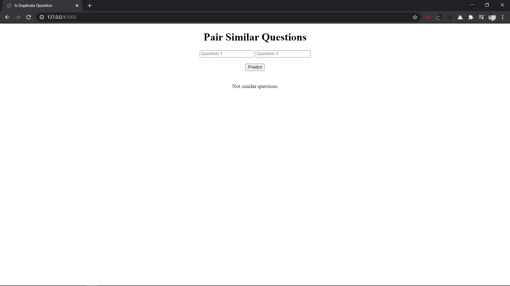

# Pairing_Similar_Questions
Quora Question Pairing

The deployed model is LightGBM as its logloss comes out to be --  0.3964

 Gradient Boosting Classifier logloss --  0.4144
 
 Random Forest Classifire logloss --  0.4252

Get the dataset from [here](https://www.kaggle.com/c/quora-question-pairs/data)
